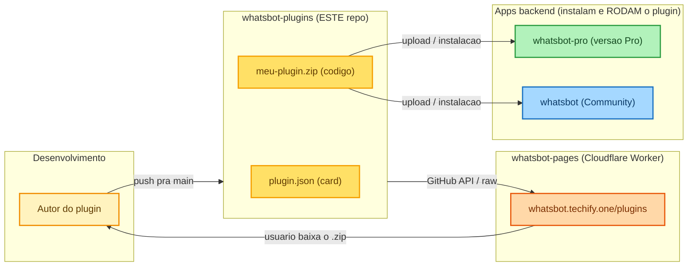
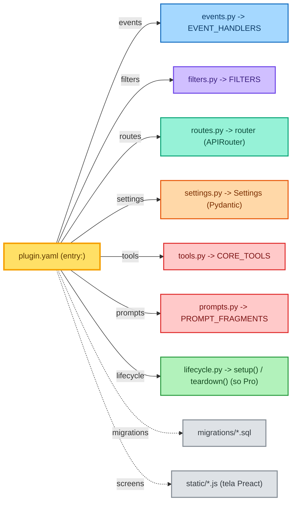
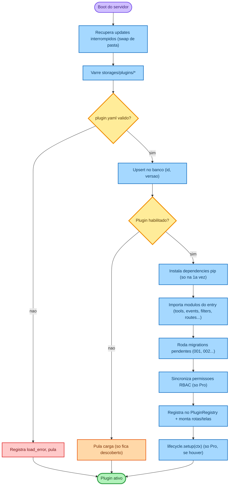
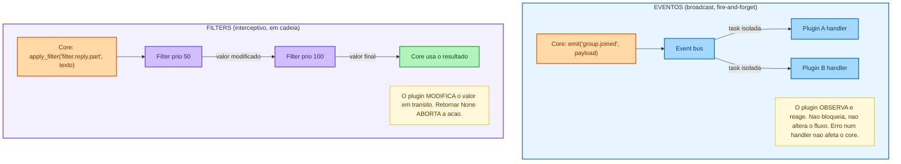
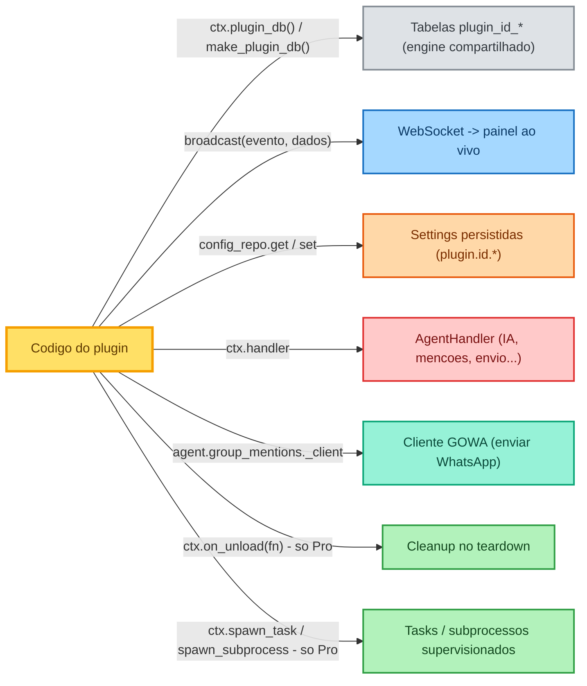
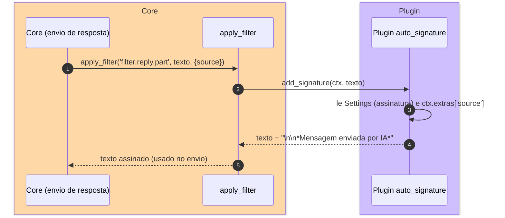
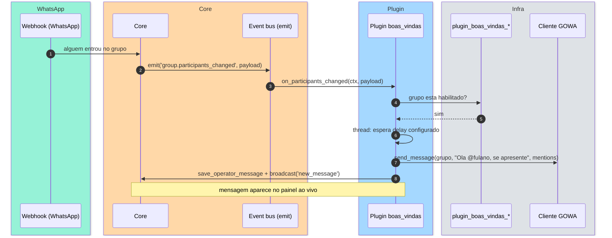

# Arquitetura de Plugins do WhatsBot

Documentação didática de como funciona o sistema de plugins do WhatsBot —
o que é cada repositório, como um plugin é carregado, quais "ganchos" (hooks)
ele pode usar e o passo a passo para criar um.

> Os diagramas estão em blocos ` ```mermaid `. Para visualizar/editar no
> Excalidraw: abra https://excalidraw.com → menu (hambúrguer) → **"Mermaid to
> Excalidraw"** → cole o bloco → **Insert**.

---

## 1. Os 4 repositórios e onde o plugin "vive"

O ecossistema tem 4 repos com papéis distintos. **Este repositório
(`whatsbot-plugins`) é só a "loja": fonte de dados.** Ele NÃO executa plugin —
ele guarda o `plugin.json` (metadados do card) + o `.zip` (o código real).



Resumo dos papéis:

| Repo | Papel |
|------|-------|
| **whatsbot-plugins** (este) | Fonte de dados: `plugin.json` + `.zip`. Não roda nada. |
| **whatsbot-pages** | Página de produção (`/plugins`), Cloudflare Worker. Lê este repo via GitHub API e serve o card + botão de download. Cache de 5 min no edge. |
| **whatsbot-pro** | App backend "Pro" (Python/FastAPI). Tem o **motor de plugins completo**: RBAC, lifecycle (`setup`/`teardown`), auditoria, supervisor de tasks/subprocessos. |
| **whatsbot** | App backend "Community", mais enxuto. Mesmo motor de plugins, **sem** RBAC, lifecycle e audit. |

### Esse repositório serve pro Pro e pro Community?

**Sim.** Um mesmo `.zip` pode ser instalado nos dois apps, porque ambos
expõem a **mesma API de plugin** (`plugins.context`, `db.repositories`, bus de
eventos/filters, migrations). A compatibilidade é controlada pelo campo
`whatsbot_api_version` do manifesto (semver).

A diferença é só de **capacidades extras** que existem só no Pro:

| Recurso do manifesto | Pro | Community |
|----------------------|-----|-----------|
| tools, prompts, events, filters, routes, settings, screens, migrations | ✅ | ✅ |
| `rbac:` (permissões de usuário) | ✅ | ignorado |
| `lifecycle` (`setup`/`teardown`, tasks, subprocessos) | ✅ | ausente |
| auditoria | ✅ | ausente |

Um plugin que só usa o núcleo comum roda nos dois. Um plugin que depende de
`lifecycle`/`rbac` só funciona pleno no Pro (no Community os campos extras são
ignorados, sem quebrar o boot).

---

## 2. Anatomia de um plugin (estrutura de pastas)

Cada plugin é uma pasta cujo **nome == `id` do manifesto**. Dentro do `.zip`,
a estrutura típica:

```
meu_plugin/
├── plugin.yaml          # MANIFESTO (obrigatório) — id, versão, entry, screens...
├── __init__.py          # marca a pasta como pacote Python (pode ser vazio)
├── events.py            # EVENT_HANDLERS = {"group.joined": fn}   (assina eventos)
├── filters.py           # FILTERS = {"filter.reply.part": fn}     (intercepta valores)
├── routes.py            # router = APIRouter()                    (endpoints REST)
├── settings.py          # class Settings(BaseModel)               (form automático)
├── tools.py             # CORE_TOOLS = [(schema, executor)]       (ferramentas de IA)
├── migrations/
│   └── 001_initial.sql  # tabelas plugin_<id>_*  (rodadas em ordem)
└── static/
    └── meu_plugin.js     # tela (screen) Preact renderizada no painel
```

> ⚠️ Há **dois** arquivos de metadados, não confunda:
> - **`plugin.json`** (na raiz da pasta no repo `whatsbot-plugins`) → é só o
>   **card da loja** (nome, descrição, ícone, qual `.zip` baixar).
> - **`plugin.yaml`** (dentro do `.zip`) → é o **manifesto real** que o app lê
>   ao instalar: `id`, `entry`, `screens`, `migrations`, `permissions`, etc.

### Como o manifesto liga arquivos a capacidades

O bloco `entry:` mapeia cada capacidade ao módulo (`.py`) que a implementa.
O loader importa só o que estiver declarado.



### Exemplo de `plugin.yaml`

```yaml
id: boas_vindas                       # snake_case, == nome da pasta
name: Boas-vindas em Grupos
version: 1.0.1                         # semver obrigatório
whatsbot_api_version: ">=1.0,<2.0"     # faixa de compatibilidade
description: >-
  Marca com @ quem entra num grupo ativado, pedindo que se apresente.
author: WhatsBot
entry:
  events: events                      # importa events.py
  routes: routes                      # importa routes.py
migrations: migrations                # pasta com os .sql
screens:
  - id: boas-vindas-config
    title: Boas-vindas em Grupos
    path: /boas-vindas
    icon: user-plus
    component: /plugins/boas_vindas/static/boas_vindas.js
    config: true                      # vira a tela do modal "Configurar"
permissions: []
dependencies: []                      # pacotes pip (instalados no 1o load)
```

---

## 3. Ciclo de carregamento (o que acontece no boot)

No startup do app, `discover_and_load(storages/plugins)` varre as pastas e,
para cada plugin **habilitado**, executa esta sequência. Plugin com erro é
isolado: registra `load_error` e o app continua subindo.



Pontos importantes:

- **Habilitar/desabilitar** é um flag no banco — não apaga a pasta. Plugin
  desabilitado é "descoberto" mas não carregado (não assina nada, não cria rota).
- **Migrations** rodam em ordem (`001_`, `002_`, ...) e são idempotentes
  (`CREATE TABLE IF NOT EXISTS`). Toda tabela do plugin **deve** começar com o
  prefixo `plugin_<id>_` — é a convenção de isolamento (não há banco separado
  por plugin; todos compartilham o mesmo engine SQLAlchemy).
- **Atualização sem perder dados**: o swap de pasta é feito em 2 renames com
  recuperação automática se a máquina cair no meio.

---

## 4. Os ganchos: Eventos vs Filters (o coração da extensibilidade)

Existem **dois mecanismos** para um plugin reagir ao core sem tocar no código
dele. Entender a diferença é o ponto-chave da arquitetura:



| | **Eventos** | **Filters** |
|---|---|---|
| Intenção | "aconteceu X" (notificação) | "estou prestes a usar Y, quer mudar?" |
| Exporta | `EVENT_HANDLERS = {nome: fn}` | `FILTERS = {nome: fn}` ou `{nome: (fn, prioridade)}` |
| Assinatura | `fn(ctx, payload)` | `fn(ctx, value) -> value | None` |
| Pode alterar o fluxo? | Não (observador) | Sim (transforma o valor; `None` aborta) |
| Ordem | registro | por prioridade (menor roda antes) |
| Falha do plugin | isolada, ignorada | isolada; valor passa adiante sem alteração |

### Catálogo (principais nomes válidos)

**Eventos** (`KNOWN_EVENTS`) — alguns dos mais usados:
`message.received`, `message.sent`, `message.persisted`, `message.reaction`,
`group.participants_changed`, `group.joined`, `call.received`,
`connection.changed`, `conversation.created`, `conversation.status_changed`,
`contact.tagged`, `tag.created`, `llm.before`/`llm.after`,
`tool.before`/`tool.after`, `app.startup`/`app.shutdown`.
Especiais: `*` (curinga, recebe tudo) e `message.any` (recebe `received`+`sent`
com `direction`).

**Filters** (`KNOWN_FILTERS`) — alguns dos mais usados:
`filter.webhook.payload`, `filter.message.before_save`,
`filter.transcription.should_run`/`result`, `filter.contact.tags`,
`filter.system_prompt`, `filter.llm.messages`, `filter.llm.tools`,
`filter.tool.args`/`result`,
`filter.reply.raw`/`filter.reply.parts`/`filter.reply.part`,
`filter.event.before_emit`.

> Um nome fora do catálogo não é erro — só gera um WARNING (provável typo).
> Plugins podem inclusive publicar filters próprios para outros plugins consumirem.

---

## 5. O que o plugin recebe (contexto e serviços)

Todo handler recebe um objeto de contexto (`EventContext`, `FilterContext`,
`PluginContext`, `ToolContext`...). Os principais recursos disponíveis:



- **Banco**: `with ctx.plugin_db() as conn: conn.execute(text("..."))`. Use
  sempre o prefixo `plugin_<id>_` nas tabelas.
- **Tempo real**: `broadcast("new_message", {...})` empurra pro painel sem reload.
- **Settings**: declare uma `class Settings(BaseModel)` → o painel gera o
  formulário automático em `/plugins`; os valores ficam em `config` com prefixo
  `plugin.<id>.`.
- **REST do plugin**: tudo em `routes.py` fica sob `/api/plugins/<id>/...`,
  já protegido pela senha do painel (e por RBAC, no Pro, via `plugin_permission`).

---

## 6. Exemplos de fluxo real

### 6a. Filter interceptivo — Auto Signature

Adiciona uma assinatura no fim de cada parte de resposta enviada.



### 6b. Evento — Boas-vindas em grupos

Reage a alguém entrando num grupo ativado, sem tocar no core.



---

## 7. Passo a passo: criar um plugin novo

1. **Crie a pasta** `meu_plugin/` (nome em `snake_case` = `id`).
2. **Escreva o `plugin.yaml`** (manifesto): `id`, `name`, `version`,
   `whatsbot_api_version`, e o bloco `entry:` apontando os módulos que você vai
   usar.
3. **Implemente as capacidades** que precisar:
   - reagir a algo → `events.py` com `EVENT_HANDLERS`;
   - modificar algo em trânsito → `filters.py` com `FILTERS`;
   - guardar estado → `migrations/001_initial.sql` (tabelas `plugin_meu_plugin_*`);
   - config pelo painel → `settings.py` (`Settings`) e/ou `routes.py` + `static/*.js`.
4. **Teste local** instalando no app (Pro e/ou Community).
5. **Empacote** o conteúdo da pasta num `.zip`.
6. **Publique na loja**: crie `plugins/meu-plugin/` neste repo com o `.zip` + um
   `plugin.json` (card) apontando o arquivo, e dê `push` na `main`. Em até 5 min
   aparece em `whatsbot.techify.one/plugins`.

> Regra de ouro do isolamento: **não toque no core**. Use eventos para observar,
> filters para modificar, tabelas com prefixo `plugin_<id>_` para o estado, e
> `broadcast` para a UI ao vivo. Assim o mesmo plugin roda no Pro e no Community.
