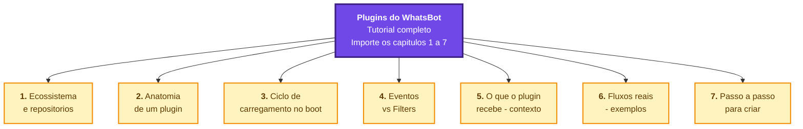
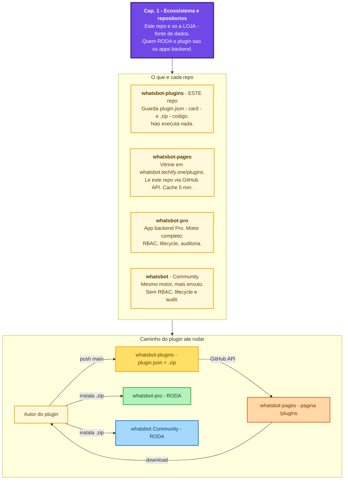
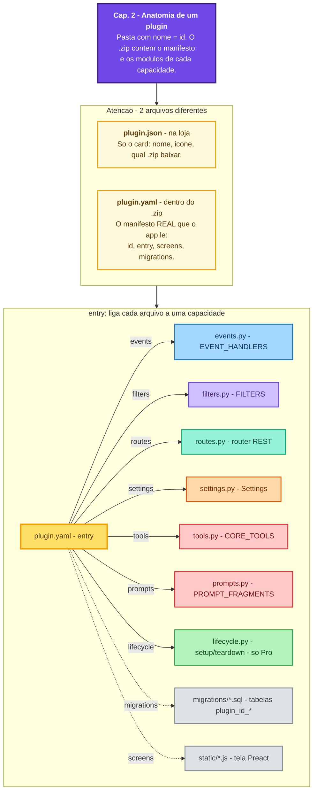
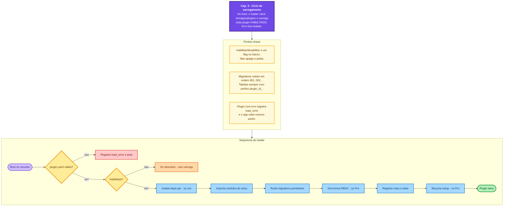
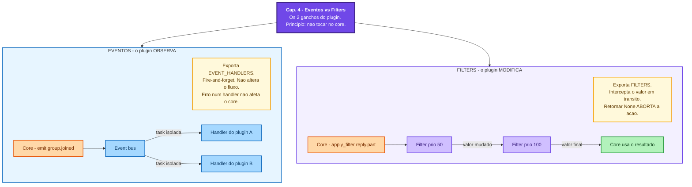
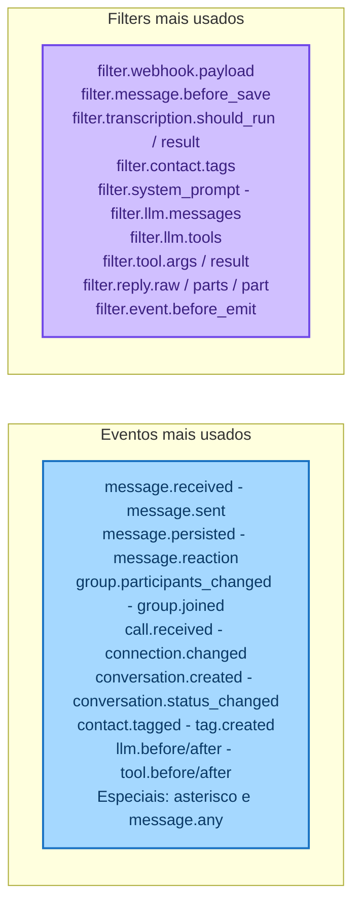
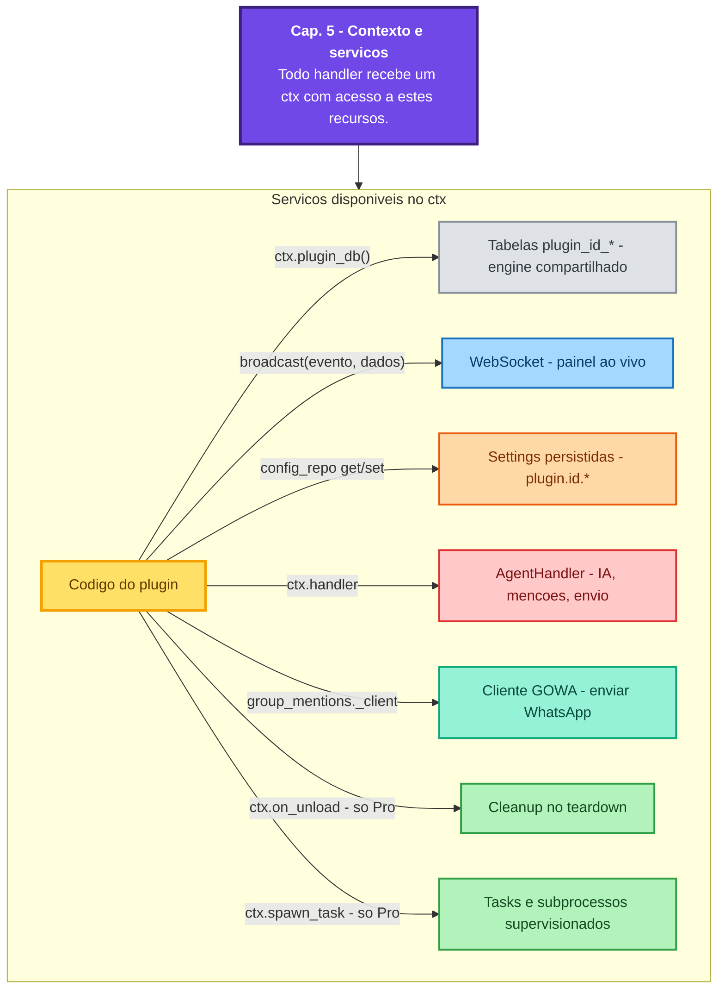
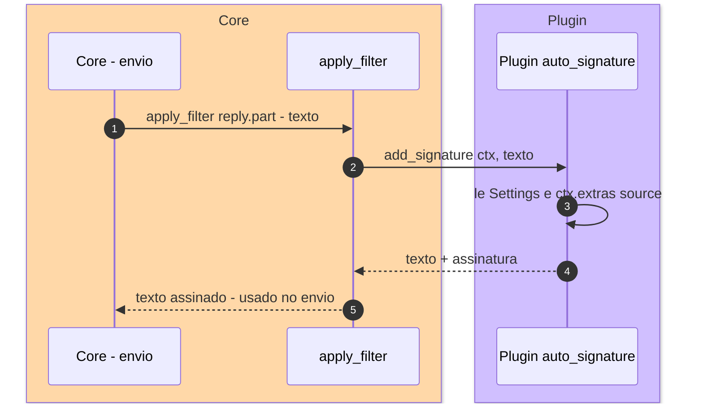
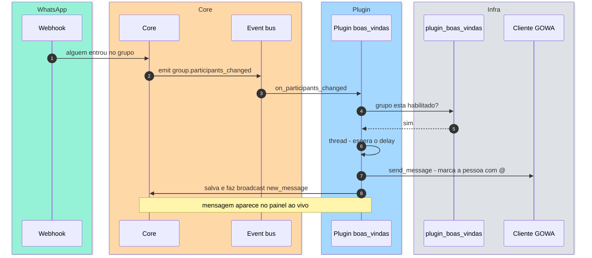
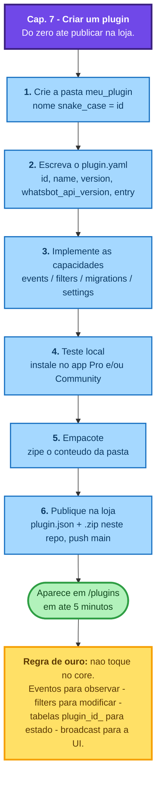

# Tutorial de Plugins do WhatsBot — versão Excalidraw

Esta é a versão **pensada para o Excalidraw**: cada capítulo abaixo é um painel
Mermaid único que já inclui o **título, a explicação em cartões e o diagrama**.
Ao importar, você não recebe só o desenho — recebe o tutorial completo como
formas editáveis, pronto para virar um quadro didático.

> ⚠️ **Forma mais fácil (sem erro):** use os arquivos `.mmd` **puros** em
> [diagramas-excalidraw/](diagramas-excalidraw/) — um por capítulo. Abra o
> arquivo → `Ctrl+A` → `Ctrl+C` → cole em **"Mermaid to Excalidraw"**.
>
> **Se for copiar daqui deste `.md`:** copie SÓ as linhas de dentro do bloco —
> **NÃO** inclua a cerca ` ``` ` nem o título `## Capítulo ...` que vem depois.
> Pegar esse texto a mais causa o erro
> `Parse error ... commC;```---## Capítulo 2`. Por isso os `.mmd` são mais seguros.
>
> **Como importar cada painel:** no Excalidraw → menu (hambúrguer) ou
> `Mais ferramentas` → **"Mermaid to Excalidraw"** → cole UM diagrama por vez →
> **Insert**. Cada capítulo vira um quadro; arraste-os lado a lado.
>
> Conteúdo idêntico em prosa tradicional está em
> [ARQUITETURA-PLUGINS.md](ARQUITETURA-PLUGINS.md).

---

## Capítulo 0 — Mapa do tutorial (índice visual)



---

## Capítulo 1 — Ecossistema e repositórios



---

## Capítulo 2 — Anatomia de um plugin



---

## Capítulo 3 — Ciclo de carregamento no boot



---

## Capítulo 4 — Eventos vs Filters (o coração)



### Catálogo de nomes (cartão de consulta)



---

## Capítulo 5 — O que o plugin recebe (contexto e serviços)



---

## Capítulo 6 — Fluxos reais (exemplos)

### 6a. Filter interceptivo — Auto Signature



### 6b. Evento — Boas-vindas em grupos



---

## Capítulo 7 — Passo a passo para criar um plugin


